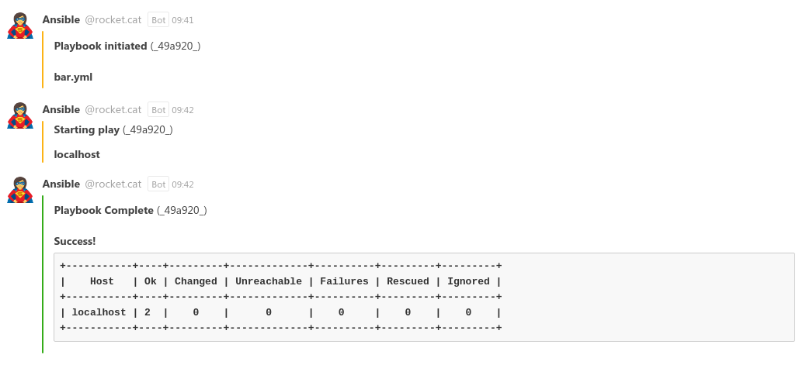

# Rockchat callback plugin for Ansible



This callback plugin is based on the work of Deepak Kothandan, which has been published on [GitHub](https://gist.github.com/Deepakkothandan/4808bcb4e9881e2d4fe8a643a9bab4eb)

## Usage

Copy the plugin (`rocketchat.py`) into your `callback_plugins` folder and configure at least the webhook. 

The plugin can be configured via `ansible.cfg` (section `callback_rocketchat`) or environment variables:

| ini key |  env var | required | default | description |
|---|---|---|---|---|
| `webhook_url` | `ROCKETCHAT_WEBHOOK_URL` | **YES** | | Rocketchat Webhook URL |
| `username` | `ROCKETCHAT_USERNAME` | no | `ansible` | Username to post as |
| `channel` | `ROCKETCHAT_CHANNEL` | no | (configured in webhook) | Rocketchat room to post in. The default (empty) will use the default configured in the webhook. |
| `icon_url` | `ROCKETCHAT_ICON_URL` | no | - | Icon url for user avatar |
| `icon_emoji` | `ROCKETCHAT_ICON_emoji` | no | - | Icon emoji for user avatar |
| `validate_certs` | `ROCKETCHAT_VALIDATE_CERTS` | no | `true` | validate the TLS certificate of the Rocketchat server. (For HTTPS URLs) |


Example configuration:
```ini
[callback_rocketchat]
username = Ansible
channel = #yoloops
icon_emoji = :superhero:
webhook_url = https://rocket.example.com/yourrocketchatwebhooktoken
```

